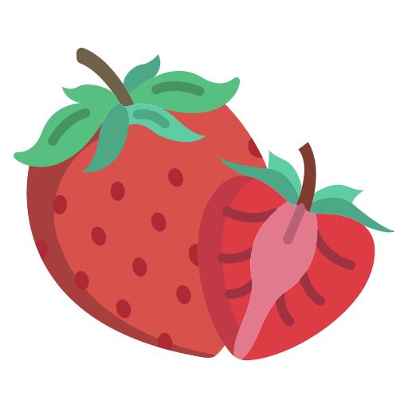

<p align="center"> 
	
</p>
<div align="center">
    
    
<h1 align="center">
	Strawberry
</h1>
<p align="center">
  A toy object-oriented programming language written by rust
</p>
</div>

## 🍓Why strawberry

Just because I happened to be eating strawberries when I had this idea!

## 🌟 About the Project

This is a toy object-oriented language, a practice project after I finished learning CS143, there are many features it does not support, and API will keep changing until version1.0 (if I can do this), so please just think of it as a small language for learning.

## 🎯Features
- :white_check_mark: Object-oriented.

- :white_check_mark: Output readable x86 assembly code and run it natively.

- :white_check_mark: Type inference at variable definition time.

- :construction: Support for generics.

- :construction: More APIs.


## ☀ Getting Started

### ❗️ Prerequisites

Your computer should be a linux system, forgive me for not being able to support windows. This project requires that your PC be installed with gcc and cargo.Use following commands to check it!

```
gcc -version
cargo --version
```

If you successfully display the version information, then move on.

### ⚙️ Installation

1. Clone the repo

   ```
   git clone https://github.com/mumu12641/strawberry.git
   ```

2. Install

   ```
   make install
   ```
   
   This command will install strawberry to \$HOME/.cargo/bin, and create  $HOME/.strawberry folder and install std library to this folder, please do not modify the contents of this folder.

### 👀Usage

1. Create project

   ```
   strawberry new example
   ```

2. Build it

   ```
   cd ./example
   strawberry build
   ```

3. Run it

   ```
   ./build/a.out
   ```

## :bulb:VSC Support

Please search for [strawberry-support](https://marketplace.visualstudio.com/items?itemName=muuuuu.strawberry-support) in VSCode and install it.Currently it only supports some simple syntax highlighting.

## :pushpin:Code Examples

The syntax of strawberry is very similar to object-oriented languages such as java, I believe you can master it quickly.

### hello world

```
class Main { 
	fun main() -> Int {
	    	print("hello world!");
	    	return 0;
	};
};
```

### Class definitions

```
// in strawberry, every class must start with a capital letter
class Main {
	a:Int = 0;	// variable of the Main class
	
	fun main() -> Int {
		let a:Int = 1;	// variable in main method, this 'a' will cover Main's 'a'
		let b = 2;	// it is also ok not to declare the type, but it needs to be initialized
		let c:String = "this is c";		
		let d:Bool = true;
	    	return 0;
	};
};
```

### Class Inheritance

```
class Main{
	fun main() -> Int {
		let square = new Square;
		square.set(2);
		print(squrae.get_area().to_string());		// output:4
		return 0;
	};
	fun draw(shape:Shape) -> Shape {
		shape.draw();
		return shape;
	};
};

class Shape {
    name:String = "shape";
    
    public fun get_area() -> Int{
        return 0;
    };
};

class Square inherits Shape{
    a:Int = 0;
    
    public fun set(x:Int) -> Int{
        a = x;
        return 0;
    };
    
    public fun get_area() -> Int{
        return a*a;
    };

};
```

### if & while & for

```
class Main{
    fun main() -> Int {
        let a = 5;
	print(a.to_string() + "\\n");
	for(let b = 2; b < 5; b = b + 1;){
		print(b.to_string() + "\\n");
	}
	while(a > 0){
		if(a > 3){
			print("a > 3\\n");
		}else{
			print("a <= 3\\n");
		}
		a = a - 1;
	}
        return 0;
    };
};

/*
    output:
    5
    2
    3
    4
    a > 3
    a > 3
    a <= 3
    a <= 3
    a <= 3
*/
```

### LinkedList

```
class Main { 
	fun main() -> Int { 
		let n1 = new Node;
		let n2 = new Node;
		let n3 = new Node;
		let n4 = new Node;
		n1.set_val(1);
		n2.set_val(2);
		n3.set_val(3);
		n4.set_val(4);

		let l = new List;
		l.insert(n1);
		l.insert(n2);
		l.insert(n3);
		l.insert(n4);
		let h = l.get_head();

		while(!null(h)){
			print(h.to_string());
			h = h.get_next();
		}
		
		return 0; 
	};
};

class Node{
	val:Int = 0;
	next:Node;

    public fn set_val(val_:Int) -> Int{
		val = val_;
		return 0;
	};

    public fn set_next(next_:Node) -> Int{
		next = next_;
		return 0;
	};

    public fn get_next() -> Node{
		return next;
	};

    public fn to_string() -> String{
		return val.to_string() + "\\n";
	};
};

class List{
	head:Node;
	tail:Node;

    public fn insert(node:Node) -> Int{
		if(null(head)){
			head = node;
			tail = head;
		}else{
			tail.set_next(node);
			tail = node;
		}
		return 0;
	};

    public fn get_head() -> Node{
		return head;
	};
};
```

